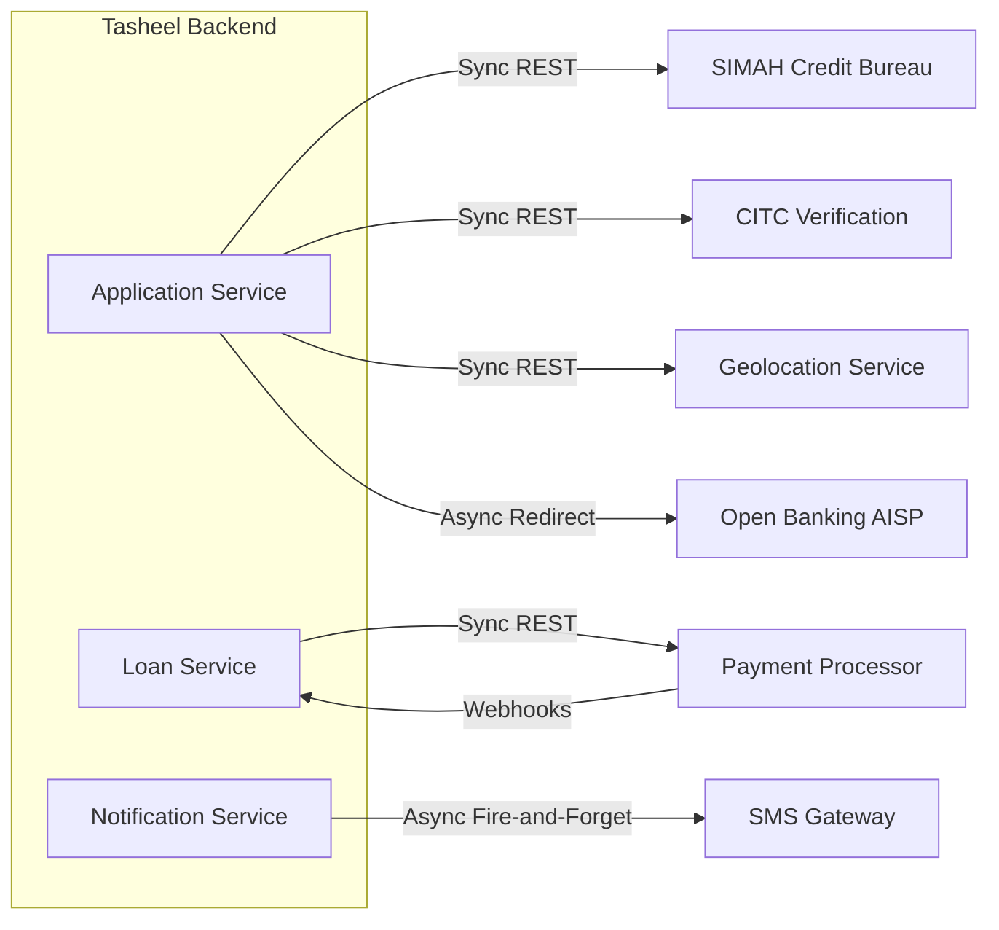
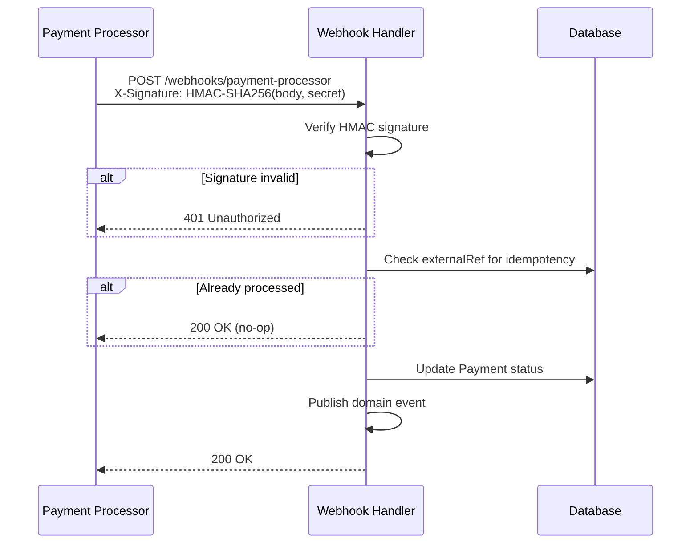

# Tasheel Finance — Integration Architecture (Baseline)

> External system integrations, event-driven messaging, circuit breaker configuration, and webhook handling.

## 1. External System Integrations



### 1.1 SIMAH (Credit Bureau)

| Attribute | Value |
|---|---|
| Protocol | Sync REST (HTTPS) |
| Operations | Soft search (pre-qualification), Hard search (full assessment) |
| Auth | mTLS + API key |
| Timeout | 30s |
| Called during | `AssessApplication` handler |
| Data returned | Credit score, active obligations, delinquency flags |

Per **EA6**, SIMAH responses are not cached — each search is a point-in-time regulatory requirement.

### 1.2 CITC (National ID & Employment)

| Attribute | Value |
|---|---|
| Protocol | Sync REST (HTTPS) |
| Operations | ID verification, employment status check |
| Auth | OAuth2 client credentials |
| Timeout | 15s |
| Called during | `AssessApplication` handler |
| Data returned | Identity confirmation, employer name, employment status |

### 1.3 Geolocation

| Attribute | Value |
|---|---|
| Protocol | Sync REST (HTTPS) |
| Operations | Address verification, coordinate-to-address resolution |
| Auth | API key |
| Timeout | 10s |
| Called during | Application submission validation |

### 1.4 Open Banking (AISP)

| Attribute | Value |
|---|---|
| Protocol | Async redirect flow (OAuth2 authorization code) |
| Operations | Bank statement retrieval for affordability assessment |
| Auth | OAuth2 (customer-delegated consent) |
| Flow | App redirects customer to bank → customer authorises → callback with auth code → backend exchanges for token → fetches statements |
| Timeout | N/A (user-driven) — token exchange: 15s |
| Called during | Pre-assessment (optional, improves approval odds) |

### 1.5 Payment Processor

| Attribute | Value |
|---|---|
| Protocol | Sync REST (disbursement, card tokenisation) + Webhooks (auto-debit results) |
| Operations | Tokenise card, initiate disbursement, schedule auto-debit, process manual payment |
| Auth | API key + HMAC signature on webhooks |
| Timeout | 30s (sync calls) |
| Called during | `DisburseLoan`, `CollectPayment`, card registration |

### 1.6 SMS Gateway

| Attribute | Value |
|---|---|
| Protocol | Async fire-and-forget (HTTP POST) |
| Operations | Send OTP, send status notification |
| Auth | API key |
| Timeout | 5s (fire-and-forget, no retry on HTTP level — retried via message queue) |
| Called during | OTP generation, application state changes, payment reminders |

## 2. Event Topics (per EA8)

All domain events are published to Azure Service Bus topics. Consumers subscribe with durable subscriptions.

| Topic | Key Events | Publishers | Consumers |
|---|---|---|---|
| `application-events` | `application.created`, `application.submitted`, `application.assessed`, `application.abandoned` | Application Service | Notification Service, Analytics |
| `offer-events` | `offer.generated`, `offer.accepted`, `offer.expired` | Offer Service | Notification Service, Application Service |
| `loan-events` | `loan.disbursed`, `loan.settled`, `loan.closed` | Loan Service | Notification Service, Analytics |
| `notification-events` | `notification.sent`, `notification.failed` | Notification Service | Analytics, Dead-letter monitoring |

### Event Envelope (per EA8)

```json
{
  "eventId": "uuid",
  "eventType": "application.submitted",
  "occurredAt": "2026-04-20T12:00:00Z",
  "correlationId": "uuid",
  "aggregateId": "uuid",
  "aggregateType": "LoanApplication",
  "version": 1,
  "payload": { }
}
```

## 3. Circuit Breaker Configuration

Per **EA6**, all external integrations use circuit breakers (Polly/.NET or equivalent).

| Integration | Failure Threshold | Break Duration | Retry Policy | Fallback |
|---|---|---|---|---|
| SIMAH | 5 failures in 60s | 30s open | 2 retries, exponential backoff (1s, 3s) | Fail assessment, transition to Referred |
| CITC | 5 failures in 60s | 30s open | 2 retries, exponential backoff (1s, 3s) | Fail assessment, transition to Referred |
| Geolocation | 3 failures in 30s | 15s open | 1 retry after 1s | Skip geo-verification, flag for manual review |
| Open Banking | 3 failures in 60s | 30s open | 1 retry after 2s | Continue without bank statements |
| Payment Processor | 3 failures in 30s | 60s open | 3 retries, exponential backoff (2s, 5s, 10s) | Queue for retry, alert ops |
| SMS Gateway | 10 failures in 60s | 15s open | No sync retry — requeued via Service Bus | Dead-letter after 3 requeue attempts |

### Health Degradation

When a circuit breaker opens:
1. `/health/ready` reports `Degraded` for the affected dependency
2. Alert fires to ops channel
3. Metrics counter incremented (`circuit_breaker_open_total{integration="simah"}`)

## 4. Webhook Handling — Payment Processor Callbacks

The payment processor sends asynchronous status updates for auto-debit collections and disbursements.

### Endpoint

```
POST /api/v1/webhooks/payment-processor
```

- Not behind JWT auth — secured via HMAC signature verification
- Idempotent — uses `externalRef` as idempotency key

### Verification Flow



### Webhook Payload

```json
{
  "externalRef": "pay_abc123",
  "status": "collected",
  "amount": 1500.00,
  "currency": "SAR",
  "processedAt": "2026-04-20T10:30:00Z",
  "failureReason": null
}
```

### Status Mapping

| Processor Status | Internal Payment Status | Action |
|---|---|---|
| `collected` | Collected | Update balance, publish `payment.collected` |
| `failed` | Failed | Publish `payment.failed`, schedule retry if retryable |
| `reversed` | Failed | Reverse balance adjustment, alert ops |

### Retry & Dead-Letter

- Payment processor retries webhook delivery 3 times with exponential backoff (1min, 5min, 30min)
- If all retries fail, payment processor marks webhook as failed — Tasheel runs a reconciliation job every 6 hours to catch missed callbacks
