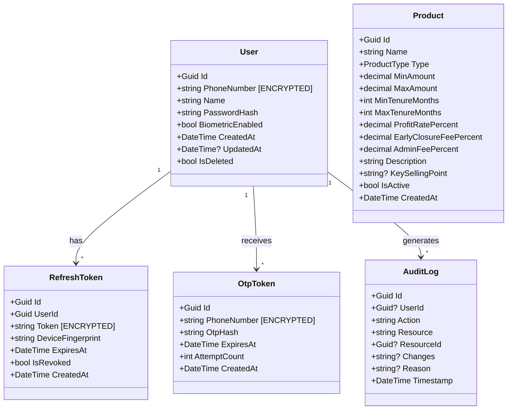
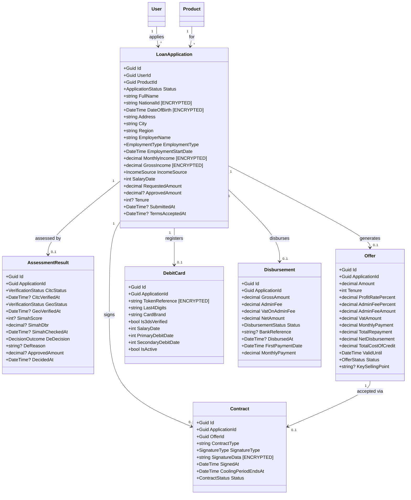

# BridgeNow Finance — Low-Level Design
### Sprint 1 (EP-01: Platform Foundation & Authentication)

---

## 1. Domain Model (Sprint 1)



---

## 2. Database Schemas

### auth_db.Users

| Column | Type | Constraints | Notes |
|--------|------|------------|-------|
| Id | uniqueidentifier | PK, DEFAULT NEWSEQUENTIALID() | |
| PhoneNumber | nvarchar(20) | NOT NULL, UNIQUE | [ENCRYPTED] AES-256 |
| Name | nvarchar(200) | NULL | Set after first login |
| PasswordHash | nvarchar(500) | NULL | BCrypt, work factor 12 |
| BiometricEnabled | bit | NOT NULL, DEFAULT 0 | |
| CreatedAt | datetimeoffset | NOT NULL | |
| CreatedBy | nvarchar(100) | NOT NULL, DEFAULT 'system' | |
| UpdatedAt | datetimeoffset | NULL | |
| UpdatedBy | nvarchar(100) | NULL | |
| IsDeleted | bit | NOT NULL, DEFAULT 0 | Soft delete |
| Version | rowversion | | Optimistic concurrency |

**Indexes**: `IX_Users_PhoneNumber` (unique), `IX_Users_IsDeleted`

### auth_db.OtpTokens

| Column | Type | Constraints | Notes |
|--------|------|------------|-------|
| Id | uniqueidentifier | PK | |
| PhoneNumber | nvarchar(20) | NOT NULL | [ENCRYPTED] AES-256 |
| OtpHash | nvarchar(500) | NOT NULL | SHA-256 hashed |
| ExpiresAt | datetimeoffset | NOT NULL | CreatedAt + 90 seconds |
| AttemptCount | int | NOT NULL, DEFAULT 0 | Max 5 attempts |
| CreatedAt | datetimeoffset | NOT NULL | |
| IsDeleted | bit | NOT NULL, DEFAULT 0 | |

**Indexes**: `IX_OtpTokens_PhoneNumber_ExpiresAt`
**Cleanup**: Background job purges expired tokens every hour

### auth_db.RefreshTokens

| Column | Type | Constraints | Notes |
|--------|------|------------|-------|
| Id | uniqueidentifier | PK | |
| UserId | uniqueidentifier | FK → Users, NOT NULL | |
| Token | nvarchar(500) | NOT NULL, UNIQUE | [ENCRYPTED] AES-256 |
| DeviceFingerprint | nvarchar(200) | NOT NULL | Device binding |
| ExpiresAt | datetimeoffset | NOT NULL | CreatedAt + 24 hours |
| IsRevoked | bit | NOT NULL, DEFAULT 0 | |
| CreatedAt | datetimeoffset | NOT NULL | |

**Indexes**: `IX_RefreshTokens_Token` (unique), `IX_RefreshTokens_UserId`
**Rotation**: Old token revoked when new one issued

### auth_db.AuditLogs

| Column | Type | Constraints | Notes |
|--------|------|------------|-------|
| Id | uniqueidentifier | PK | |
| UserId | uniqueidentifier | NULL | NULL for anonymous actions |
| Action | nvarchar(50) | NOT NULL | USER_REGISTERED, OTP_SENT, OTP_VERIFIED, TOKEN_ISSUED, TOKEN_REFRESHED, LOGIN_FAILED |
| Resource | nvarchar(50) | NOT NULL | User, OtpToken, RefreshToken |
| ResourceId | uniqueidentifier | NULL | |
| Changes | nvarchar(max) | NULL | JSON diff |
| Reason | nvarchar(500) | NULL | |
| Timestamp | datetimeoffset | NOT NULL | |

**Rules**: Append-only (no UPDATE/DELETE). Separate from application DB per EA12.

### products_db.Products

| Column | Type | Constraints | Notes |
|--------|------|------------|-------|
| Id | uniqueidentifier | PK, DEFAULT NEWSEQUENTIALID() | |
| Name | nvarchar(100) | NOT NULL | |
| Type | nvarchar(20) | NOT NULL | BridgeNow, Cash, Combo |
| MinAmount | decimal(18,2) | NOT NULL | |
| MaxAmount | decimal(18,2) | NOT NULL | |
| MinTenureMonths | int | NOT NULL | |
| MaxTenureMonths | int | NOT NULL | |
| ProfitRatePercent | decimal(5,2) | NOT NULL | |
| EarlyClosureFeePercent | decimal(5,2) | NOT NULL | |
| AdminFeePercent | decimal(5,2) | NOT NULL | |
| Description | nvarchar(500) | NULL | |
| KeySellingPoint | nvarchar(200) | NULL | "No Early Closure Charges" |
| IsActive | bit | NOT NULL, DEFAULT 1 | |
| CreatedAt | datetimeoffset | NOT NULL | |
| CreatedBy | nvarchar(100) | NOT NULL | |
| UpdatedAt | datetimeoffset | NULL | |
| UpdatedBy | nvarchar(100) | NULL | |
| IsDeleted | bit | NOT NULL, DEFAULT 0 | |
| Version | rowversion | | |

**Indexes**: `IX_Products_Type`, `IX_Products_IsActive`
**Seed data**: BridgeNow (24mo, 27%, 0% early, 0.5% admin, SAR 4k-30k), Cash, Combo

---

## 3. CQRS Handlers (Sprint 1)

### auth-service Handlers

| Handler | Type | Input | Validation | Logic | Output | Events |
|---------|------|-------|------------|-------|--------|--------|
| **RegisterCommand** | Command | phoneNumber | Saudi format (+966, 10 digits) | Check rate limit (3/10min). Generate 6-digit OTP. Hash with SHA-256. Store in OtpTokens (90s expiry). Send via SMS gateway. | { otpSent, expiresInSeconds, maskedPhone } | user.otp_sent |
| **VerifyOtpCommand** | Command | phoneNumber, otpCode | 6 digits, not empty | Find latest non-expired OTP for phone. Compare hash. Increment attemptCount. If match: create/find User, issue JWT. If fail: check attempts (max 5). | TokenResponse | user.otp_verified |
| **TokenCommand** | Command | phoneNumber, otpCode, deviceFingerprint | Phone + OTP valid | Same as VerifyOtp but also stores deviceFingerprint on RefreshToken. | TokenResponse | user.authenticated |
| **RefreshTokenCommand** | Command | refreshToken, deviceFingerprint | Token not empty | Find token in DB. Check not revoked, not expired, device matches. Revoke old token. Issue new access + refresh tokens. | TokenResponse | token.refreshed |

### products-service Handlers

| Handler | Type | Input | Validation | Logic | Output |
|---------|------|-------|------------|-------|--------|
| **GetProductsQuery** | Query | (none, optional type filter) | — | Select all active products. Filter by type if provided. Order by: BridgeNow first, then by name. | Product[] |
| **GetProductQuery** | Query | productId (GUID) | Valid GUID | Find by ID where IsActive=true and IsDeleted=false. | Product or 404 |

### MediatR Pipeline Behaviours (both services)

| Behaviour | Order | Purpose |
|-----------|-------|---------|
| **ValidationBehaviour** | 1 | FluentValidation — reject invalid requests with 400 |
| **LoggingBehaviour** | 2 | Log handler name, duration, correlation ID |
| **PerformanceBehaviour** | 3 | Warn if handler >500ms (EA7 p95 target) |
| **AuditBehaviour** | 4 | Write to AuditLogs for commands (not queries) |

---

## 4. Mobile Architecture (Sprint 1)

### ViewModels

| ViewModel | Screen | State | Actions | Dependencies |
|-----------|--------|-------|---------|-------------|
| **LoginViewModel** | Login | UiState\<Unit\> + phoneNumber + isLoading | sendOtp(), loginBiometric() | AuthRepository |
| **OtpViewModel** | OTP | UiState\<TokenResponse\> + digits[6] + timer + attempts | verifyOtp(), resendOtp() | AuthRepository |
| **ProductListViewModel** | Product List | UiState\<List\<Product\>\> | load(), refresh() | ProductRepository |
| **ProductDetailViewModel** | BridgeNow Landing | UiState\<Product\> | load(productId) | ProductRepository |

### Repositories

| Repository | Methods | Data Source |
|-----------|---------|-------------|
| **AuthRepository** | sendOtp(phone), verifyOtp(phone, code), refreshToken(), getBiometricStatus() | TasheelAuthApi (Retrofit) + EncryptedSharedPreferences |
| **ProductRepository** | getProducts(), getProduct(id) | TasheelProductsApi (Retrofit) + Room (cache) |

### Retrofit API Interfaces

```kotlin
// AuthApi.kt — points to auth-service :5001
interface TasheelAuthApi {
    @POST("auth/register") suspend fun register(@Body req: RegisterRequest): ApiResponse<OtpSentResponse>
    @POST("auth/verify-otp") suspend fun verifyOtp(@Body req: VerifyOtpRequest): ApiResponse<TokenResponse>
    @POST("auth/token") suspend fun login(@Body req: LoginRequest): ApiResponse<TokenResponse>
    @POST("auth/refresh") suspend fun refresh(@Body req: RefreshRequest): ApiResponse<TokenResponse>
}

// ProductsApi.kt — points to products-service :5002
interface TasheelProductsApi {
    @GET("products") suspend fun getProducts(): ApiResponse<List<ProductDto>>
    @GET("products/{id}") suspend fun getProduct(@Path("id") id: String): ApiResponse<ProductDto>
}
```

### Room Database (Offline Cache)

```kotlin
@Entity(tableName = "product_cache")
data class ProductCacheEntity(
    @PrimaryKey val id: String,
    val name: String,
    val type: String,
    val jsonData: String,  // Full product JSON for offline display
    val cachedAt: Long     // Timestamp, TTL 1 hour
)

@Dao
interface ProductCacheDao {
    @Query("SELECT * FROM product_cache WHERE cachedAt > :minTime")
    suspend fun getCached(minTime: Long): List<ProductCacheEntity>
    
    @Insert(onConflict = OnConflictStrategy.REPLACE)
    suspend fun insertAll(products: List<ProductCacheEntity>)
}
```

### Navigation Graph

```kotlin
sealed class Screen(val route: String) {
    data object Login : Screen("login")
    data object Otp : Screen("otp/{phone}") { fun create(phone: String) = "otp/$phone" }
    data object ProductList : Screen("products")
    data object ProductDetail : Screen("products/{id}") { fun create(id: String) = "products/$id" }
}

// NavGraph.kt
NavHost(startDestination = if (hasValidSession) Screen.ProductList.route else Screen.Login.route) {
    composable(Screen.Login.route) { LoginScreen(onOtpSent = { nav.navigate(Screen.Otp.create(it)) }) }
    composable(Screen.Otp.route) { OtpScreen(onVerified = { nav.navigate(Screen.ProductList.route) { popUpTo(0) } }) }
    composable(Screen.ProductList.route) { ProductListScreen(onProductClick = { nav.navigate(Screen.ProductDetail.create(it)) }) }
    composable(Screen.ProductDetail.route) { ProductDetailScreen(onApply = { /* Sprint 2 */ }) }
}
```

---

## 5. Hilt DI Modules (Sprint 1)

```kotlin
@Module @InstallIn(SingletonComponent::class)
object AuthNetworkModule {
    @Provides @Singleton
    fun provideAuthApi(@Named("authClient") client: OkHttpClient): TasheelAuthApi =
        Retrofit.Builder().baseUrl(BuildConfig.AUTH_BASE_URL).client(client)
            .addConverterFactory(GsonConverterFactory.create()).build()
            .create(TasheelAuthApi::class.java)
}

@Module @InstallIn(SingletonComponent::class)
object ProductsNetworkModule {
    @Provides @Singleton
    fun provideProductsApi(@Named("productsClient") client: OkHttpClient): TasheelProductsApi =
        Retrofit.Builder().baseUrl(BuildConfig.PRODUCTS_BASE_URL).client(client)
            .addConverterFactory(GsonConverterFactory.create()).build()
            .create(TasheelProductsApi::class.java)
}
```

**Note**: Separate OkHttpClient per service — auth client has AuthInterceptor, products client does not (public endpoints). Per MS6 bulkhead isolation.

---

## 6. Testing Plan (Sprint 1)

### Backend Unit Tests (xUnit + NSubstitute)

| Test Class | Handler | Key Tests |
|-----------|---------|-----------|
| RegisterCommandTests | RegisterCommand | Valid phone → OTP sent, invalid format → 400, rate limited → 429 |
| VerifyOtpCommandTests | VerifyOtpCommand | Correct OTP → tokens, wrong OTP → 401 + attempts, expired → 401, max attempts → 429 |
| RefreshTokenCommandTests | RefreshTokenCommand | Valid refresh → new tokens, expired → 401, wrong device → 401, revoked → 401 |
| GetProductsQueryTests | GetProductsQuery | Returns active products, BridgeNow first, filter by type |
| GetProductQueryTests | GetProductQuery | Found → product, not found → 404, deleted → 404 |

### Mobile Unit Tests (JUnit 5 + MockK + Turbine)

| Test Class | ViewModel | Key Tests |
|-----------|-----------|-----------|
| LoginViewModelTest | LoginViewModel | sendOtp success → navigate, invalid phone → error, loading state |
| OtpViewModelTest | OtpViewModel | verify success → tokens stored, wrong code → error + attempts, timer countdown |
| ProductListViewModelTest | ProductListViewModel | load success → products, load error → error state, refresh |

### Integration Tests

| Test | Scope | Method |
|------|-------|--------|
| Auth flow E2E | register → verify → token → refresh | WebApplicationFactory |
| Products listing | GET /products returns seeded data | WebApplicationFactory |
| Contract tests | Response schemas match OpenAPI spec | Schema validation |

---

## 7. Seed Data

---

## 8. JWT Configuration

```csharp
// auth-service appsettings.json
{
  "Jwt": {
    "Issuer": "bridgenow-auth-service",
    "Audience": "bridgenow-mobile",
    "AccessTokenExpiryMinutes": 15,
    "RefreshTokenExpiryHours": 24,
    "SigningKeySource": "AzureKeyVault"  // RS256 key pair in Key Vault, rotated every 90 days
  }
}
```

- **Algorithm**: RS256 (asymmetric — auth-service holds private key, other services validate with public key)
- **Access token**: 15-minute expiry, contains userId, roles, deviceFingerprint
- **Refresh token**: 24-hour expiry, opaque (stored in DB), device-bound, rotated on use
- **Key rotation**: Every 90 days via Azure Key Vault. Old keys valid for 24hrs after rotation (grace period).

---

## 9. EF Core Configuration

```csharp
// auth-service: UserConfiguration.cs
public class UserConfiguration : IEntityTypeConfiguration<User>
{
    public void Configure(EntityTypeBuilder<User> builder)
    {
        builder.HasKey(e => e.Id);
        builder.Property(e => e.Id).HasDefaultValueSql("NEWSEQUENTIALID()");
        builder.Property(e => e.PhoneNumber).HasMaxLength(20).IsRequired();
        builder.HasIndex(e => e.PhoneNumber).IsUnique();
        builder.HasQueryFilter(e => !e.IsDeleted);  // Soft delete global filter
        builder.Property(e => e.Version).IsRowVersion();  // Optimistic concurrency
    }
}

// products-service: ProductConfiguration.cs — same pattern
// Each service has its own DbContext pointing to its own database
```

**Migration strategy**: EF Core code-first. Migrations run as K8s init container before app pods start (per EA4).

---

## 10. Deployment Notes

```dockerfile
# auth-service Dockerfile
FROM mcr.microsoft.com/dotnet/sdk:8.0-alpine AS build
WORKDIR /src
COPY . .
RUN dotnet publish -c Release -o /app

FROM mcr.microsoft.com/dotnet/aspnet:8.0-alpine
RUN adduser -D appuser
WORKDIR /app
COPY --from=build /app .
USER appuser
EXPOSE 5001
HEALTHCHECK --interval=10s CMD wget -qO- http://localhost:5001/health || exit 1
ENTRYPOINT ["dotnet", "AuthService.Api.dll"]
```

- **Each service**: own Dockerfile, own image, own K8s deployment
- **Ports**: auth-service :5001, products-service :5002
- **Environment config**: `AUTH_BASE_URL` and `PRODUCTS_BASE_URL` in mobile BuildConfig, injected via CI

## 7. Seed Data

```sql
-- products_db seed
INSERT INTO Products (Id, Name, Type, MinAmount, MaxAmount, MinTenureMonths, MaxTenureMonths, 
    ProfitRatePercent, EarlyClosureFeePercent, AdminFeePercent, Description, KeySellingPoint, IsActive)
VALUES
    ('11111111-1111-1111-1111-111111111111', 'BridgeNow Finance', 'BridgeNow', 
     4000, 30000, 24, 24, 27.00, 0.00, 0.50, 
     'Easy Salary Advance for your immediate needs', 'No Early Closure Charges', 1),
    ('22222222-2222-2222-2222-222222222222', 'Cash Finance', 'Cash',
     5000, 250000, 3, 60, 20.00, 1.00, 1.50,
     'Flexible personal finance with risk-based pricing', NULL, 1),
    ('33333333-3333-3333-3333-333333333333', 'Combo Finance', 'Combo',
     10000, 500000, 6, 60, 18.00, 1.50, 1.00,
     'Combined finance package with competitive rates', NULL, 1);
```

---

# Sprint 2 LLD Additions (EP-02: Application & Data Capture, EP-03: Assessment, Offer & Disbursement)

## 1a. Domain Model [EP-02/EP-03]



### Enums [EP-02/EP-03]

| Enum | Values |
|------|--------|
| ApplicationStatus | Draft, Submitted, Verifying, Approved, Referred, Declined, OfferGenerated, OfferAccepted, Disbursing, Active |
| EmploymentType | Employed, SelfEmployed, Retired |
| IncomeSource | Api, OpenBanking, Manual |
| VerificationStatus | Pending, Passed, Failed, Error |
| DecisionOutcome | Approved, Referred, Declined |
| OfferStatus | Generated, Accepted, Expired, Voided |
| ContractStatus | Signed, CooledOff, Cancelled |
| SignatureType | TypedName, Biometric |
| DisbursementStatus | Initiated, Completed, Failed |

## 2a. Database Schemas [EP-02/EP-03]

### applications_db.LoanApplications [EP-02]

| Column | Type | Constraints | Notes |
|--------|------|-------------|-------|
| Id | uniqueidentifier | PK, DEFAULT NEWID() | |
| UserId | uniqueidentifier | NOT NULL, FK→auth_db.Users | |
| ProductId | uniqueidentifier | NOT NULL, FK→products_db.Products | |
| Status | nvarchar(20) | NOT NULL, DEFAULT 'Draft' | ApplicationStatus enum |
| FullName | nvarchar(200) | NOT NULL | |
| NationalId | nvarchar(500) | NULL | [ENCRYPTED] AES-256 |
| DateOfBirth | nvarchar(500) | NULL | [ENCRYPTED] AES-256, stored as encrypted date |
| Address | nvarchar(500) | NULL | |
| City | nvarchar(100) | NULL | |
| Region | nvarchar(100) | NULL | |
| EmployerName | nvarchar(200) | NULL | |
| EmploymentType | nvarchar(20) | NULL | Employed/SelfEmployed/Retired |
| EmploymentStartDate | date | NULL | |
| MonthlyIncome | nvarchar(500) | NULL | [ENCRYPTED] AES-256 |
| GrossIncome | nvarchar(500) | NULL | [ENCRYPTED] AES-256 |
| IncomeSource | nvarchar(20) | NULL | Api/OpenBanking/Manual |
| SalaryDate | int | NULL | 1-28 |
| RequestedAmount | decimal(18,2) | NULL | |
| ApprovedAmount | decimal(18,2) | NULL | Set by DE |
| Tenure | int | NULL | Months |
| SubmittedAt | datetime2 | NULL | |
| TermsAcceptedAt | datetime2 | NULL | |
| CreatedAt | datetime2 | NOT NULL, DEFAULT GETUTCDATE() | EA4 |
| CreatedBy | nvarchar(100) | NOT NULL | EA4 |
| UpdatedAt | datetime2 | NOT NULL | EA4 |
| UpdatedBy | nvarchar(100) | NOT NULL | EA4 |
| IsDeleted | bit | NOT NULL, DEFAULT 0 | EA4 soft delete |
| Version | rowversion | | EA4 optimistic concurrency |

**Indexes**: IX_LoanApplications_UserId, IX_LoanApplications_ProductId, IX_LoanApplications_Status

### assessment_db.AssessmentResults [EP-03]

| Column | Type | Constraints | Notes |
|--------|------|-------------|-------|
| Id | uniqueidentifier | PK, DEFAULT NEWID() | |
| ApplicationId | uniqueidentifier | NOT NULL, UNIQUE | One assessment per application |
| CitcStatus | nvarchar(20) | NOT NULL, DEFAULT 'Pending' | VerificationStatus |
| CitcVerifiedAt | datetime2 | NULL | |
| GeoStatus | nvarchar(20) | NOT NULL, DEFAULT 'Pending' | VerificationStatus |
| GeoVerifiedAt | datetime2 | NULL | |
| SimahScore | int | NULL | 0-999 |
| SimahDbr | decimal(5,2) | NULL | Debt Burden Ratio % |
| SimahCheckedAt | datetime2 | NULL | |
| DeDecision | nvarchar(20) | NULL | Approved/Referred/Declined |
| DeReason | nvarchar(500) | NULL | |
| ApprovedAmount | decimal(18,2) | NULL | |
| DecidedAt | datetime2 | NULL | |
| CreatedAt | datetime2 | NOT NULL, DEFAULT GETUTCDATE() | EA4 |
| CreatedBy | nvarchar(100) | NOT NULL | EA4 |
| UpdatedAt | datetime2 | NOT NULL | EA4 |
| UpdatedBy | nvarchar(100) | NOT NULL | EA4 |
| IsDeleted | bit | NOT NULL, DEFAULT 0 | EA4 |
| Version | rowversion | | EA4 |

**Indexes**: IX_AssessmentResults_ApplicationId (UNIQUE)

### offers_db.Offers [EP-03]

| Column | Type | Constraints | Notes |
|--------|------|-------------|-------|
| Id | uniqueidentifier | PK, DEFAULT NEWID() | |
| ApplicationId | uniqueidentifier | NOT NULL | |
| Amount | decimal(18,2) | NOT NULL | Approved amount |
| Tenure | int | NOT NULL | Months |
| ProfitRatePercent | decimal(5,2) | NOT NULL | |
| AdminFeePercent | decimal(5,2) | NOT NULL | |
| AdminFeeAmount | decimal(18,2) | NOT NULL | |
| VatAmount | decimal(18,2) | NOT NULL | 15% VAT on admin fee |
| MonthlyPayment | decimal(18,2) | NOT NULL | |
| TotalRepayment | decimal(18,2) | NOT NULL | |
| NetDisbursement | decimal(18,2) | NOT NULL | Amount - AdminFee - VAT |
| TotalCostOfCredit | decimal(18,2) | NOT NULL | TotalRepayment - Amount (PD5) |
| ValidUntil | datetime2 | NOT NULL | |
| Status | nvarchar(20) | NOT NULL, DEFAULT 'Generated' | OfferStatus |
| KeySellingPoint | nvarchar(200) | NULL | |
| CreatedAt | datetime2 | NOT NULL | EA4 |
| CreatedBy | nvarchar(100) | NOT NULL | EA4 |
| UpdatedAt | datetime2 | NOT NULL | EA4 |
| UpdatedBy | nvarchar(100) | NOT NULL | EA4 |
| IsDeleted | bit | NOT NULL, DEFAULT 0 | EA4 |
| Version | rowversion | | EA4 |

**Indexes**: IX_Offers_ApplicationId
**Financial ops**: Serializable isolation for offer generation (EA4)

### offers_db.Contracts [EP-03]

| Column | Type | Constraints | Notes |
|--------|------|-------------|-------|
| Id | uniqueidentifier | PK | |
| ApplicationId | uniqueidentifier | NOT NULL | |
| OfferId | uniqueidentifier | NOT NULL, FK→Offers | |
| ContractType | nvarchar(20) | NOT NULL, DEFAULT 'Tawarruq' | |
| SignatureType | nvarchar(20) | NOT NULL | TypedName/Biometric |
| SignatureData | nvarchar(500) | NOT NULL | [ENCRYPTED] AES-256 |
| SignedAt | datetime2 | NOT NULL | |
| CoolingPeriodEndsAt | datetime2 | NOT NULL | SignedAt + 24 hours (SAMA) |
| Status | nvarchar(20) | NOT NULL, DEFAULT 'Signed' | ContractStatus |
| CreatedAt | datetime2 | NOT NULL | EA4 |
| CreatedBy | nvarchar(100) | NOT NULL | EA4 |
| UpdatedAt | datetime2 | NOT NULL | EA4 |
| UpdatedBy | nvarchar(100) | NOT NULL | EA4 |
| IsDeleted | bit | NOT NULL, DEFAULT 0 | EA4 |
| Version | rowversion | | EA4 |

**Indexes**: IX_Contracts_ApplicationId, IX_Contracts_OfferId

### offers_db.DebitCards [EP-03]

| Column | Type | Constraints | Notes |
|--------|------|-------------|-------|
| Id | uniqueidentifier | PK | |
| ApplicationId | uniqueidentifier | NOT NULL | |
| TokenReference | nvarchar(500) | NOT NULL | [ENCRYPTED] AES-256, PCI-DSS token |
| Last4Digits | nvarchar(4) | NOT NULL | |
| CardBrand | nvarchar(20) | NULL | Visa/Mastercard/mada |
| Is3dsVerified | bit | NOT NULL, DEFAULT 0 | |
| SalaryDate | int | NOT NULL | 1-28 |
| PrimaryDebitDate | int | NOT NULL | = SalaryDate |
| SecondaryDebitDate | int | NOT NULL | = SalaryDate + 3 (wraps at month end) |
| IsActive | bit | NOT NULL, DEFAULT 1 | |
| CreatedAt | datetime2 | NOT NULL | EA4 |
| CreatedBy | nvarchar(100) | NOT NULL | EA4 |
| UpdatedAt | datetime2 | NOT NULL | EA4 |
| UpdatedBy | nvarchar(100) | NOT NULL | EA4 |
| IsDeleted | bit | NOT NULL, DEFAULT 0 | EA4 |
| Version | rowversion | | EA4 |

**Indexes**: IX_DebitCards_ApplicationId

### offers_db.Disbursements [EP-03]

| Column | Type | Constraints | Notes |
|--------|------|-------------|-------|
| Id | uniqueidentifier | PK | |
| ApplicationId | uniqueidentifier | NOT NULL | |
| GrossAmount | decimal(18,2) | NOT NULL | = Offer.Amount |
| AdminFee | decimal(18,2) | NOT NULL | |
| VatOnAdminFee | decimal(18,2) | NOT NULL | 15% of AdminFee |
| NetAmount | decimal(18,2) | NOT NULL | Gross - AdminFee - VAT |
| Status | nvarchar(20) | NOT NULL, DEFAULT 'Initiated' | DisbursementStatus |
| BankReference | nvarchar(100) | NULL | From payment processor |
| DisbursedAt | datetime2 | NULL | |
| FirstPaymentDate | date | NOT NULL | Calculated from SalaryDate |
| MonthlyPayment | decimal(18,2) | NOT NULL | From Offer |
| CreatedAt | datetime2 | NOT NULL | EA4 |
| CreatedBy | nvarchar(100) | NOT NULL | EA4 |
| UpdatedAt | datetime2 | NOT NULL | EA4 |
| UpdatedBy | nvarchar(100) | NOT NULL | EA4 |
| IsDeleted | bit | NOT NULL, DEFAULT 0 | EA4 |
| Version | rowversion | | EA4 |

**Indexes**: IX_Disbursements_ApplicationId
**Financial ops**: Serializable isolation for disbursement (EA4)

### Modified Table: auth_db.Users [EP-03]

```sql
-- Zero-downtime migration (EA4): additive only
ALTER TABLE auth_db.Users ADD NationalId nvarchar(500) NULL;
-- [ENCRYPTED] AES-256, nullable for backward compatibility
-- Index added for SIMAH lookup
CREATE INDEX IX_Users_NationalId ON auth_db.Users(NationalId) WHERE NationalId IS NOT NULL;
```

## 3a. CQRS Handlers [EP-02/EP-03]

### applications-service Handlers [EP-02]

| Handler | Type | Input | Validation | Logic | Output | Events |
|---------|------|-------|------------|-------|--------|--------|
| CreateApplicationCommand | Command | userId, productId | User exists, Product active | Create Draft application | ApplicationDto | ApplicationCreated |
| UpdateApplicationCommand | Command | applicationId, personal?, employment?, income? | App in Draft status, field validation | Merge partial update, auto-save | ApplicationDto | — |
| GetApplicationQuery | Query | applicationId | App exists, user owns it | Return application with status | ApplicationDto | — |
| ListApplicationsQuery | Query | userId, status?, page | User authenticated | Filter by user + optional status, paginate | ApplicationDto[] | — |
| SubmitApplicationCommand | Command | applicationId, termsAccepted | App in Draft, all required fields filled, termsAccepted=true | Set status=Submitted, trigger assessment via REST to assessment-svc | ApplicationDto | ApplicationSubmitted |
| GetIncomeDataQuery | Query | applicationId | App exists | Call employer API, calculate eligibleAmount (1x income, cap SAR 30k, floor SAR 4k) | IncomeDataDto | — |
| InitiateOpenBankingCommand | Command | applicationId | App exists, employer unlisted | Generate consent URL, store consentId | OpenBankingRedirectDto | — |
| OpenBankingCallbackCommand | Command | applicationId, consentId, status | Valid consentId | Process bank data, update income fields | IncomeDataDto | — |

### assessment-service Handlers [EP-03]

| Handler | Type | Input | Validation | Logic | Output | Events |
|---------|------|-------|------------|-------|--------|--------|
| AssessApplicationCommand | Command | applicationId | App in Submitted status | 1. CITC check → 2. Geo check → 3. SIMAH check → 4. Decision Engine (DBR ≤33%, 1x income cap, min SAR 4k, SIMAH ≥500) | AssessmentResultDto | ApplicationStatusChanged |

**Decision Engine Pseudocode [EP-03]:**
```
IF citc.status == Failed OR geo.status == Failed → decision = Referred
IF simah.score < 500 → decision = Declined, reason = "Credit score below minimum"
IF simah.dbr > 33% → decision = Declined, reason = "DBR exceeds SAMA 33% cap"
approvedAmount = MIN(monthlyIncome, 30000)  // 1x income cap
IF approvedAmount < 4000 → decision = Declined, reason = "Below minimum SAR 4,000"
ELSE → decision = Approved, approvedAmount set
```

### offers-service Handlers [EP-03]

| Handler | Type | Input | Validation | Logic | Output | Events |
|---------|------|-------|------------|-------|--------|--------|
| GenerateOfferCommand | Command | applicationId | App Approved, no existing active offer | Calculate: monthlyPayment, totalRepayment, adminFee, VAT, netDisbursement, totalCostOfCredit. Set validUntil = now + 30 days | OfferDto | OfferGenerated |
| GetOfferQuery | Query | applicationId | Offer exists | Return offer with all PD5 PCCI fields | OfferDto | — |
| AcceptOfferCommand | Command | applicationId, signatureType, signatureData | Offer Generated, not expired | Create Contract (Tawarruq), set coolingPeriodEndsAt = now + 24h, update app status = OfferAccepted | ContractDto | OfferAccepted, ContractSigned |
| CancelOfferCommand | Command | applicationId | Contract Signed, coolingPeriodEndsAt > now | Void offer, cancel contract, no charges | ContractDto | OfferCancelled |
| DeclineOfferCommand | Command | applicationId | Offer Generated | Set offer status = Voided | OfferDto | — |
| GetContractQuery | Query | applicationId | Contract exists | Return contract details | ContractDto | — |
| RegisterCardCommand | Command | applicationId, cardToken, last4, brand, salaryDate | Contract signed, cooling-off expired | Store token (encrypted), calculate dual debit dates (salary + salary+3), trigger 3DS via processor | CardRegistrationDto | — |
| DisburseCommand | Command | applicationId | Card 3DS verified | 1. 2nd SIMAH check 2. If pass: calculate net (gross - admin - VAT), initiate bank transfer 3. If fail: decline | DisbursementDto | DisbursementCompleted or DisbursementFailed |
| GetDisbursementQuery | Query | applicationId | Disbursement exists | Return disbursement details | DisbursementDto | — |

**Offer Calculation [EP-03]:**
```
adminFeeAmount = approvedAmount × adminFeePercent / 100
vatAmount = adminFeeAmount × 0.15  // 15% VAT
netDisbursement = approvedAmount - adminFeeAmount - vatAmount
monthlyPayment = approvedAmount × (1 + profitRatePercent/100 × tenure/12) / tenure
totalRepayment = monthlyPayment × tenure
totalCostOfCredit = totalRepayment - approvedAmount  // PD5 PCCI
```

## 4a. Mobile Architecture [EP-02/EP-03]

### New ViewModels [EP-02/EP-03]

| ViewModel | Screen | State Type | Dependencies |
|-----------|--------|-----------|-------------|
| ApplicationFormViewModel | Personal/Employment/Income/Review | ApplicationFormUiState | ApplicationRepository |
| ApplicationStatusViewModel | Status | UiState\<ApplicationDto\> | ApplicationRepository |
| OfferViewModel | Offer | UiState\<OfferDto\> | OfferRepository |
| ContractViewModel | Contract | ContractUiState (signing + cooling-off) | OfferRepository |
| CardCollectionViewModel | Card | CardUiState (hosted fields + 3DS) | OfferRepository |
| DisbursementViewModel | Disbursement | UiState\<DisbursementDto\> | OfferRepository |

### New Repositories [EP-02/EP-03]

| Repository | Interface | Implementation | Methods |
|-----------|-----------|---------------|---------|
| ApplicationRepository | domain/repository/ | data/repository/ApplicationRepositoryImpl | createApplication, updateApplication, getApplication, listApplications, submitApplication, getIncome, initiateOpenBanking |
| OfferRepository | domain/repository/ | data/repository/OfferRepositoryImpl | getOffer, acceptOffer, cancelOffer, declineOffer, getContract, registerCard, disburse, getDisbursement |

### New Retrofit API Interfaces [EP-02/EP-03]

```kotlin
// TasheelApplicationsApi — port 5003
interface TasheelApplicationsApi {
    @POST("applications") suspend fun create(@Body req: CreateApplicationRequest): ApiResponse<ApplicationDto>
    @PUT("applications/{id}") suspend fun update(@Path("id") id: String, @Body req: UpdateApplicationRequest): ApiResponse<ApplicationDto>
    @GET("applications/{id}") suspend fun get(@Path("id") id: String): ApiResponse<ApplicationDto>
    @GET("applications") suspend fun list(@Query("status") status: String? = null): ApiResponse<List<ApplicationDto>>
    @POST("applications/{id}/submit") suspend fun submit(@Path("id") id: String, @Body req: SubmitRequest): ApiResponse<ApplicationDto>
    @GET("applications/{id}/income") suspend fun getIncome(@Path("id") id: String): ApiResponse<IncomeDataDto>
    @POST("applications/{id}/open-banking/initiate") suspend fun initiateOB(@Path("id") id: String): ApiResponse<OpenBankingRedirectDto>
}

// TasheelOffersApi — port 5005
interface TasheelOffersApi {
    @GET("applications/{id}/offer") suspend fun getOffer(@Path("id") id: String): ApiResponse<OfferDto>
    @POST("applications/{id}/offer/accept") suspend fun accept(@Path("id") id: String, @Body req: AcceptOfferRequest): ApiResponse<ContractDto>
    @POST("applications/{id}/offer/cancel") suspend fun cancel(@Path("id") id: String): ApiResponse<ContractDto>
    @POST("applications/{id}/offer/decline") suspend fun decline(@Path("id") id: String): ApiResponse<OfferDto>
    @GET("applications/{id}/contract") suspend fun getContract(@Path("id") id: String): ApiResponse<ContractDto>
    @POST("applications/{id}/card") suspend fun registerCard(@Path("id") id: String, @Body req: RegisterCardRequest): ApiResponse<CardRegistrationDto>
    @POST("applications/{id}/disburse") suspend fun disburse(@Path("id") id: String): ApiResponse<DisbursementDto>
    @GET("applications/{id}/disbursement") suspend fun getDisbursement(@Path("id") id: String): ApiResponse<DisbursementDto>
}
```

## 10a. State Machine Transitions [EP-02/EP-03]

| From | To | Trigger | Validations | Side Effects |
|------|----|---------|-------------|-------------|
| — | Draft | CreateApplicationCommand | User + Product valid | ApplicationCreated event |
| Draft | Submitted | SubmitApplicationCommand | All fields filled, termsAccepted | ApplicationSubmitted event, trigger assessment |
| Submitted | Verifying | AssessApplicationCommand starts | App in Submitted | — |
| Verifying | Approved | All checks pass | CITC ✅, Geo ✅, SIMAH ≥500, DBR ≤33% | ApplicationStatusChanged event |
| Verifying | Referred | Any verification fails (non-critical) | CITC or Geo failed | ApplicationStatusChanged event |
| Verifying | Declined | Critical check fails | SIMAH <500 or DBR >33% or income <4k | ApplicationStatusChanged event |
| Approved | OfferGenerated | GenerateOfferCommand | App Approved, no active offer | OfferGenerated event |
| OfferGenerated | OfferAccepted | AcceptOfferCommand | Offer not expired, signature valid | OfferAccepted + ContractSigned events, cooling-off starts |
| OfferGenerated | OfferGenerated | DeclineOfferCommand | Offer exists | Offer voided (app stays in OfferGenerated for re-generation) |
| OfferAccepted | Disbursing | RegisterCardCommand + cooling-off expired | Card 3DS verified, 24h elapsed | — |
| Disbursing | Active | DisburseCommand succeeds | 2nd SIMAH pass, bank transfer success | DisbursementCompleted event |
| Disbursing | Declined | DisburseCommand fails (2nd SIMAH) | SIMAH score dropped or DBR breach | DisbursementFailed event |
| OfferAccepted | Declined | CancelOfferCommand during cooling-off | coolingPeriodEndsAt > now | OfferCancelled event, no charges |

## 6a. Testing Plan [EP-02/EP-03]

### Backend Unit Tests [EP-02/EP-03]

| Test Class | Handler | Key Tests |
|-----------|---------|-----------|
| CreateApplicationCommandTests | CreateApplicationCommand | Valid creation, invalid user, inactive product |
| UpdateApplicationCommandTests | UpdateApplicationCommand | Partial update, non-draft rejection, field validation |
| SubmitApplicationCommandTests | SubmitApplicationCommand | Valid submit, missing fields, terms not accepted |
| GetIncomeDataQueryTests | GetIncomeDataQuery | API income, eligibility calc, below-minimum rejection |
| AssessApplicationCommandTests | AssessApplicationCommand | All pass→Approved, CITC fail→Referred, SIMAH fail→Declined, DBR breach |
| GenerateOfferCommandTests | GenerateOfferCommand | Correct calculation, duplicate prevention, PD5 fields |
| AcceptOfferCommandTests | AcceptOfferCommand | Valid accept, expired offer, cooling-off start |
| CancelOfferCommandTests | CancelOfferCommand | Valid cancel during cooling-off, expired cooling-off rejection |
| RegisterCardCommandTests | RegisterCardCommand | Token storage, dual debit calc (salary+3 wrap), 3DS verification |
| DisburseCommandTests | DisburseCommand | Net calc (gross-admin-VAT), 2nd SIMAH pass, 2nd SIMAH fail |

### Mobile Unit Tests [EP-02/EP-03]

| Test Class | ViewModel | Key Tests |
|-----------|-----------|-----------|
| ApplicationFormViewModelTest | ApplicationFormViewModel | Field validation, auto-save, step navigation, submit |
| ApplicationStatusViewModelTest | ApplicationStatusViewModel | Polling, approved/referred/declined states |
| OfferViewModelTest | OfferViewModel | Load offer, accept, decline |
| ContractViewModelTest | ContractViewModel | Sign, cooling-off countdown, cancel |
| CardCollectionViewModelTest | CardCollectionViewModel | Card submit, 3DS flow, salary date calc |
| DisbursementViewModelTest | DisbursementViewModel | Load confirmation, net amount display |
