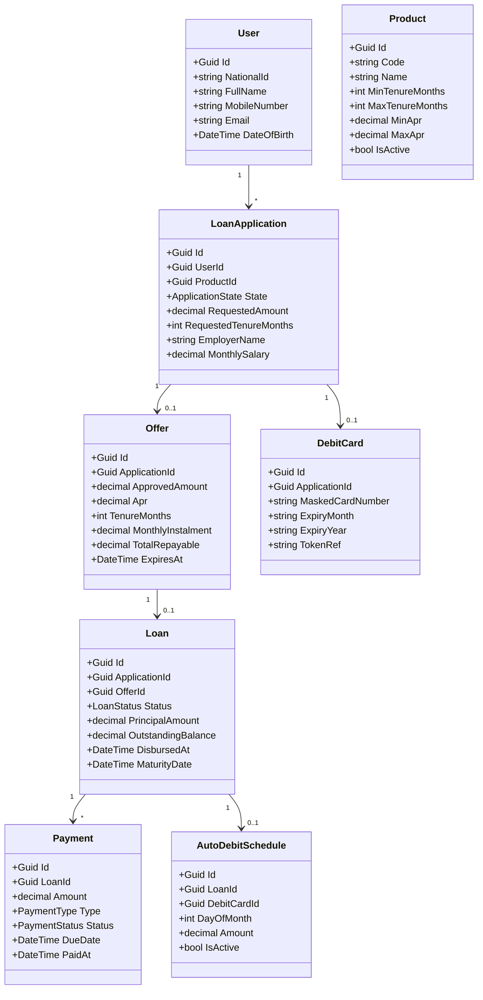
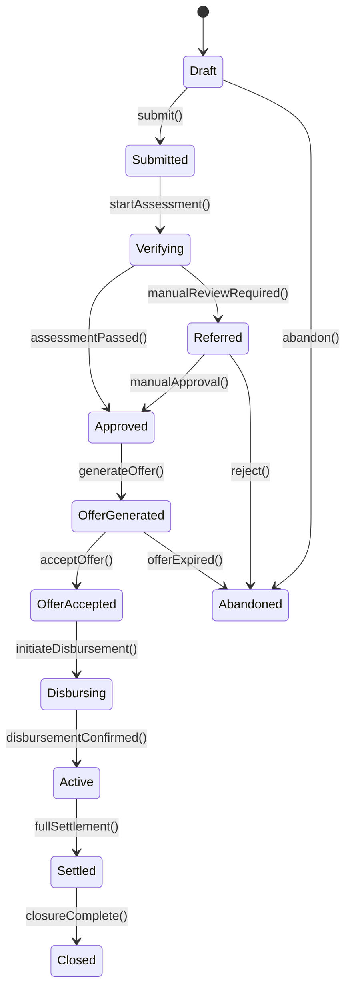

# Tasheel Finance — Low Level Design (Baseline)

> Domain model, data schema, CQRS handlers, and state machine for the existing system.

## 1. Domain Model

## 2. Application State Machine

### Transition Validation Rules

| From | To | Validations |
|---|---|---|
| Draft → Submitted | All mandatory fields populated, consent given, debit card registered |
| Submitted → Verifying | SIMAH consent obtained, no duplicate active application |
| Verifying → Approved | SIMAH score above threshold, CITC verification passed, affordability check passed |
| Verifying → Referred | Borderline score or data discrepancy flagged |
| Approved → OfferGenerated | Pricing engine returns valid offer, offer not expired |
| OfferGenerated → OfferAccepted | Offer within expiry window, user explicit acceptance |
| OfferAccepted → Disbursing | Card token valid, disbursement account verified |
| Disbursing → Active | Payment processor confirms funds transferred |
| Active → Settled | Outstanding balance = 0 (including early closure fee if applicable) |
| Settled → Closed | Liability letter generated, all auto-debits cancelled |

## 3. Key Tables

> All tables follow **EA4** audit convention: `Id` (GUID PK), `CreatedAt`, `CreatedBy`, `UpdatedAt`, `UpdatedBy`, `IsDeleted` (soft delete), `Version` (concurrency).

### Users
| Column | Type | Notes |
|---|---|---|
| Id | uniqueidentifier | PK |
| NationalId | nvarchar(20) | Unique, indexed |
| FullName | nvarchar(200) | |
| MobileNumber | nvarchar(15) | Unique |
| Email | nvarchar(200) | |
| DateOfBirth | date | |
| PasswordHash | nvarchar(500) | |
| _audit columns_ | | per EA4 |

### Products
| Column | Type | Notes |
|---|---|---|
| Id | uniqueidentifier | PK |
| Code | nvarchar(50) | e.g. `CASH_FINANCE`, `COMBO_FINANCE` |
| Name | nvarchar(200) | |
| MinTenureMonths | int | |
| MaxTenureMonths | int | |
| MinApr | decimal(5,2) | |
| MaxApr | decimal(5,2) | |
| EarlyClosureFeePercent | decimal(5,2) | |
| IsActive | bit | |
| _audit columns_ | | per EA4 |

### LoanApplications
| Column | Type | Notes |
|---|---|---|
| Id | uniqueidentifier | PK |
| UserId | uniqueidentifier | FK → Users |
| ProductId | uniqueidentifier | FK → Products |
| State | nvarchar(30) | Enum string |
| RequestedAmount | decimal(18,2) | |
| RequestedTenureMonths | int | |
| FullName | nvarchar(200) | |
| NationalId | nvarchar(20) | [ENCRYPTED] AES-256 |
| DateOfBirth | date | [ENCRYPTED] AES-256, nullable |
| Address | nvarchar(500) | Nullable |
| City | nvarchar(100) | Nullable |
| Region | nvarchar(100) | Nullable |
| EmployerName | nvarchar(200) | |
| EmploymentType | nvarchar(50) | Government/Private/Military/Self-employed |
| EmploymentStartDate | date | Nullable |
| MonthlySalary | decimal(18,2) | Net income |
| GrossIncome | decimal(18,2) | Gross income |
| OtherIncome | decimal(18,2) | Default 0 |
| SimahConsentGiven | bit | |
| SalaryDate | int | Day of month (1-28) |
| AgentId | uniqueidentifier | Nullable, for back-office |
| _audit columns_ | | CreatedAt, CreatedBy, UpdatedAt, UpdatedBy, IsDeleted, Version per EA4 |

### Offers
| Column | Type | Notes |
|---|---|---|
| Id | uniqueidentifier | PK |
| ApplicationId | uniqueidentifier | FK → LoanApplications |
| ApprovedAmount | decimal(18,2) | |
| Apr | decimal(5,2) | |
| TenureMonths | int | |
| MonthlyInstalment | decimal(18,2) | |
| TotalRepayable | decimal(18,2) | |
| ExpiresAt | datetime2 | |
| _audit columns_ | | per EA4 |

### Loans
| Column | Type | Notes |
|---|---|---|
| Id | uniqueidentifier | PK |
| ApplicationId | uniqueidentifier | FK → LoanApplications |
| OfferId | uniqueidentifier | FK → Offers |
| Status | nvarchar(20) | Active / Settled / Closed |
| PrincipalAmount | decimal(18,2) | |
| OutstandingBalance | decimal(18,2) | |
| DisbursedAt | datetime2 | |
| MaturityDate | date | |
| _audit columns_ | | per EA4 |

### Payments
| Column | Type | Notes |
|---|---|---|
| Id | uniqueidentifier | PK |
| LoanId | uniqueidentifier | FK → Loans |
| Amount | decimal(18,2) | |
| Type | nvarchar(20) | Scheduled / EarlySettlement / Partial |
| Status | nvarchar(20) | Pending / Collected / Failed |
| DueDate | date | |
| PaidAt | datetime2 | Nullable |
| ExternalRef | nvarchar(100) | Payment processor reference |
| _audit columns_ | | per EA4 |

### DebitCards
| Column | Type | Notes |
|---|---|---|
| Id | uniqueidentifier | PK |
| ApplicationId | uniqueidentifier | FK → LoanApplications |
| MaskedCardNumber | nvarchar(20) | |
| ExpiryMonth | nvarchar(2) | |
| ExpiryYear | nvarchar(4) | |
| TokenRef | nvarchar(200) | Tokenised by payment processor |
| _audit columns_ | | per EA4 |

### AutoDebitSchedules
| Column | Type | Notes |
|---|---|---|
| Id | uniqueidentifier | PK |
| LoanId | uniqueidentifier | FK → Loans |
| DebitCardId | uniqueidentifier | FK → DebitCards |
| DayOfMonth | int | |
| Amount | decimal(18,2) | |
| IsActive | bit | |
| _audit columns_ | | per EA4 |

## 4. CQRS Handlers

### Commands

| Handler | Input | Side Effects | Events Published |
|---|---|---|---|
| **CreateApplication** | userId, productId, requestedAmount, tenure | Insert LoanApplication (Draft) | `application.created` |
| **AssessApplication** | applicationId | Call SIMAH, CITC, run decision engine → transition to Approved/Referred | `application.assessed` |
| **GenerateOffer** | applicationId | Run pricing engine, insert Offer, transition to OfferGenerated | `offer.generated` |
| **AcceptOffer** | applicationId | Transition to OfferAccepted | `offer.accepted` |
| **DisburseLoan** | applicationId | Call payment processor, insert Loan, transition to Active | `loan.disbursed` |
| **CollectPayment** | loanId, amount | Call payment processor, insert Payment | `payment.collected` |
| **CalculateSettlement** | loanId | Compute outstanding + early closure fee | _(query-like, no event)_ |
| **GenerateLiabilityLetter** | loanId | Generate PDF, transition to Closed | `loan.closed` |

### Queries

| Handler | Input | Output |
|---|---|---|
| GetApplication | applicationId | Application detail + current state |
| GetOffer | applicationId | Offer detail if exists |
| GetLoan | loanId | Loan detail + schedule |
| GetPayments | loanId, pagination | Payment history |
| GetSettlementFigure | loanId | Breakdown: principal + interest + fee |
| GetTopUpEligibility | loanId | Eligible flag + max amount |
